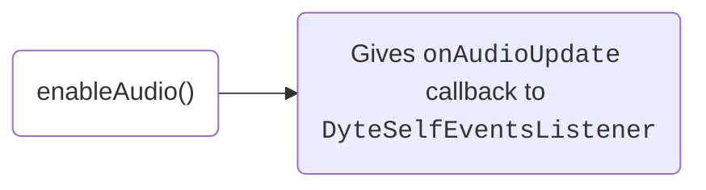
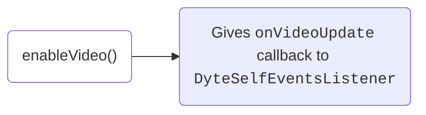

# Media Preview

Before joining a meeting, users may want to preview and configure their media devices like camera, microphone, and audio output.
This section provides developers with the tools to prepare the media environment before joining a Dyte meeting.

If you are using our UI Kits, this functionality can be handled by `DyteSetupFragment` or built with `DyteParticipantTileView`
and `DyteSettingsFragment` components.

## Properties

- `meeting.localUser.audioEnabled`: A <span className="tag-orange">boolean</span> value indicating if the audio is currently enabled.
- `meeting.localUser.videoEnabled`: A <span className="tag-orange">boolean</span> value indicating if the video is currently enabled.

## Methods

### Toggling Media

The same methods used for controlling media during a meeting are also applicable for pre-call media configuration.

**1. Mute/Unmute microphone**

<Tabs groupId="android-core-media-preview">
  <TabItem value="kotlin" label="Kotlin" default>

```kotlin
// Mute Audio
meeting.localUser.disableAudio {}

// Unmute Audio
meeting.localUser.enableAudio {}
```

  </TabItem>

  <TabItem value="java" label="Java" default>

```java
// Mute Audio
meeting.localUser.disableAudio(error -> null);

// Unmute Audio
meeting.localUser.enableAudio(error -> null);
```

  </TabItem>
</Tabs>



<br />

Anytime there is an update in the audio state of the local user, the Core SDK notifies the client through the `onAudioUpdate` callback
from `DyteSelfEventsListener`. Here's how you can register the listener:

<Tabs groupId="android-core-media-preview">
  <TabItem value="kotlin" label="Kotlin" default>

```kotlin
meeting.addSelfEventsListener(object : DyteSelfEventsListener {
    override fun onAudioUpdate(isEnabled: Boolean) {
        // Show a visual preview of the audio to the user if enabled
    }
})
```

  </TabItem>

  <TabItem value="java" label="Java" default>

```java
meeting.addSelfEventsListener(new DyteSelfEventsListener() {
    @Override
    public void onAudioUpdate(boolean isEnabled) {
        // Show a visual preview of the audio to the user if enabled
    }
});
```

  </TabItem>
</Tabs>

**2. Enable/Disable camera**

<Tabs groupId="android-core-media-preview">
  <TabItem value="kotlin" label="Kotlin" default>

```kotlin
// Disable Video
meeting.localUser.disableVideo {}

// Enable Video
meeting.localUser.enableVideo {}
```

  </TabItem>

  <TabItem value="java" label="Java" default>

```java
// Disable Video
meeting.localUser.disableVideo(error -> null);

// Enable Video
meeting.localUser.enableVideo(error -> null);
```

  </TabItem>
</Tabs>



<br />

Whenever there is an update in the video state of the local user, the Core SDK notifies the client through the `onVideoUpdate` callback
from `DyteSelfEventsListener`. Here's how you can register the listener:

<Tabs groupId="android-core-media-preview">
  <TabItem value="kotlin" label="Kotlin" default>

```kotlin
meeting.addSelfEventsListener(object : DyteSelfEventsListener {
    override fun onVideoUpdate(isEnabled: Boolean) {
        // Show local user's VideoView if video is enabled
    }
})
```

  </TabItem>

  <TabItem value="java" label="Java" default>

```java
meeting.addSelfEventsListener(new DyteSelfEventsListener() {
    @Override
    public void onVideoUpdate(boolean isEnabled) {
        // Show local user's VideoView if video is enabled
    }
});
```

  </TabItem>
</Tabs>

### Changing Media Device

Media devices represent the hardware for the camera, microphone, and speaker devices. To get the list of media devices currently
available, use the following methods:

To get the currently selected media device, use the following methods:

<Tabs groupId="android-core-media-preview">
  <TabItem value="kotlin" label="Kotlin" default>

```kotlin
// Get current audio device being used
val currentAudioDevice = meeting.localUser.getSelectedAudioDevice()

// Get current video device being used
val currentVideoDevice = meeting.localUser.getSelectedVideoDevice()
```

  </TabItem>

  <TabItem value="java" label="Java" default>

```java
// Get current audio device being used
DyteAudioDevice currentAudioDevice = meeting.localUser.getSelectedAudioDevice();

// Get current video device being used
DyteVideoDevice currentVideoDevice = meeting.localUser.getSelectedVideoDevice();
```

  </TabItem>
</Tabs>

Use these methods to create a UI that allows users to configure their media devices. When the user selects a device, use the below methods to set the device.

**Set device**

<Tabs groupId="android-core-media-preview">
  <TabItem value="kotlin" label="Kotlin" default>

```kotlin
// Set audio device
meeting.localUser.setAudioDevice(device)
// eg. device = audioDevices[0]

// Set video device
meeting.localUser.setVideoDevice(device)
// eg. device = videoDevices[0]
```

  </TabItem>

  <TabItem value="java" label="Java" default>

```java
// Set audio device
meeting.localUser.setAudioDevice(device);
// eg. device = audioDevices.get(0)

// Set video device
meeting.localUser.setVideoDevice(device);
// eg. device = videoDevices.get(0)
```

  </TabItem>
</Tabs>
