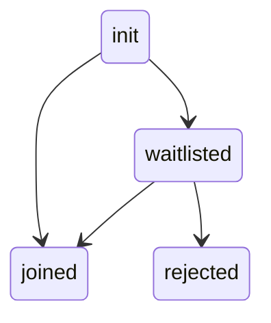

# Waiting Room

When you call `meeting.joinRoom()`, the user either enters the meeting room directly if allowed, or they are placed in the waiting room
if they are a waitlisted participant.

The diagram illustrates the possible room states the local user can be in.



<br />

### Meeting Room Joined

If user joins the room successfully, you receive the `onMeetingRoomJoinCompleted` callback in `DyteMeetingRoomEventsListener`.
You can listen for this callback as follows:

<Tabs groupId="android-core-media-preview">
  <TabItem value="kotlin" label="Kotlin" default>

```kotlin
meeting.addMeetingRoomEventsListener(object : DyteMeetingRoomEventsListener {
    override fun onMeetingRoomJoinCompleted(meeting: DyteMobileClient) {
        // Local user is in the meeting
    }
})
```

  </TabItem>

  <TabItem value="java" label="Java" default>

```java
meeting.addMeetingRoomEventsListener(new DyteMeetingRoomEventsListener() {
    @Override
    public void onMeetingRoomJoinCompleted(DyteMobileClient meeting) {
        // Local user is in the meeting
    }
})
```

  </TabItem>
</Tabs>

### Waitlisted Participant

If the user is waitlisted, the `onWaitListStatusUpdate` callback in `DyteSelfEventsListener` notifies you of any changes in the
user's waitlist status. You can check the `waitListStatus` to determine their status:

- `WAITING`: Local user is in the waiting room.
- `REJECTED`: Local user's join room request is rejected by the host.

<Tabs groupId="android-core-media-preview">
  <TabItem value="kotlin" label="Kotlin" default>

```kotlin
meeting.addSelfEventsListener(object : DyteSelfEventsListener {
    override fun onWaitListStatusUpdate(waitListStatus: WaitListStatus) {
        when (waitListStatus) {
            WAITING -> {
                // Local user is in the waiting room
            }
            REJECTED -> {
                // Local user's join room request was rejected by the host
            }
            else -> { }
        }
    }
})
```

  </TabItem>

  <TabItem value="java" label="Java" default>

```java
meeting.addSelfEventsListener(new DyteSelfEventsListener() {
    @Override
    public void onWaitListStatusUpdate(waitListStatus: WaitListStatus) {
        switch (waitListStatus) {
            case WAITING:
                // Local user is in the waiting room
                break;
            case REJECTED:
                // Local user's join room request was rejected by the host
                break;
        }
    }
});
```

  </TabItem>
</Tabs>

Host can use [these methods to accept/reject participants](/android-core/participants/waitlisted-participants).
