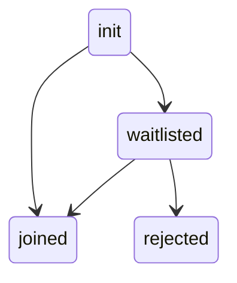

# Waiting Room

When you call `meeting.joinRoom()`, the user either enters the meeting room directly if allowed, or they are placed in the waiting room
if they are a waitlisted participant.

The diagram illustrates the possible room states the local user can be in.



<br />

### Meeting Room Joined

If user joins the room successfully, you receive the `onMeetingRoomJoinCompleted` callback in `DyteMeetingRoomEventsListener`.
You can listen for this callback as follows:

```swift
extension MeetingViewModel: DyteMeetingRoomEventsListener {
    func onMeetingRoomJoinCompleted(meeting: DyteMobileClient) {
        // Local user is in the meeting
    }
}
```

### Waitlisted Participant

If the user is waitlisted, the `onWaitListStatusUpdate` callback in `DyteSelfEventsListener` notifies you of any changes in the
user's waitlist status. You can check the `waitListStatus` to determine their status:

- `WAITING`: Local user is in the waiting room.
- `REJECTED`: Local user's join room request is rejected by the host.

```swift
extension MeetingViewModel: DyteSelfEventsListener {
    func onWaitListStatusUpdate(waitListStatus: WaitListStatus) {
        switch waitListStatus {
        case .accepted:
            // Local user's join room request was accepted by the host
        case .waiting:
            // Local user is in the waiting room
        case .rejected:
            // Local user's join room request was rejected by the host
        default:
            return .none
        }
    }
}
```

Host can use [these methods to accept/reject participants](/ios-core/participants/participant-object#waiting-room).
