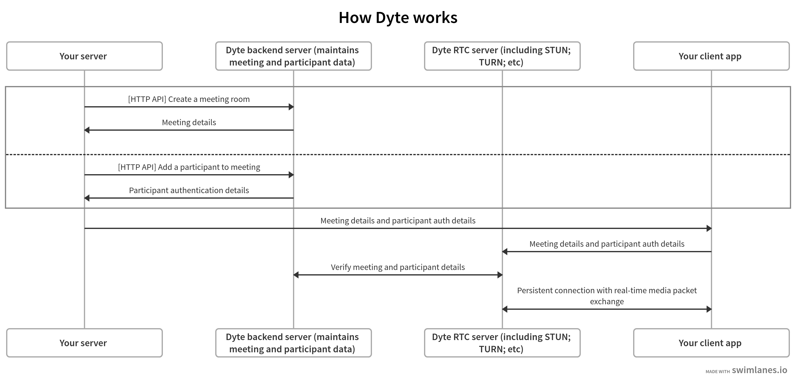

# Introduction

import Link from '@docusaurus/Link';
import GridLink from '@site/src/components/GridLink';
import GetStartedCard from '@site/src/components/GetStartedCard';
import {
  DeviceTabletIcon,
  CodeIcon,
  QuestionMarkCircleIcon,
} from '@heroicons/react/solid';
import {
  Discord as DiscordIcon,
  Github as GithubIcon,
} from '@styled-icons/boxicons-logos';
import {
  ReactIcon,
  FlutterIcon,
  JSIcon,
  AndroidIcon,
  AppleIcon,
  SDKIcon,
  APIIcon,
  ReactRevolveIcon,
  KotlinIcon,
  SwiftIcon,
  ReactNativeIcon
} from '@site/src/assets/icons';
import { HashChange } from '@site/src/components/HashChange';

<!-- Hack for highlighting menu links with anchor tags -->

<HashChange
  onLoad={() => {
    const topLink = document.querySelector(
      'a.menu__link[href="/docs/home/introduction"]'
    );
    if (topLink) {
      topLink.onclick = (e) => {
        document
          .querySelectorAll('a.menu__link')
          ?.forEach((link) => link?.classList.remove('menu__link--active'));
        e.target.classList.add('menu__link--active');
      };
    }
  }}
  onChange={() => {
    const { hash } = window.location;
    if (hash < 2) return;
    document
      .querySelectorAll('a.menu__link')
      ?.forEach((link) => link.classList.remove('menu__link--active'));
    let link =
      document.querySelector(`a.menu__link[href="${hash}"]`) ??
      document.querySelector('a.menu__link[href="/docs/home/introduction"]');
    link?.classList.add('menu__link--active');
  }}
/>

Dyte provides the easiest way to add real-time communications using video and audio to your apps and platforms.

Working with Dyte will require an integration with your application server as well as the participant-facing client (mobile or web) app where you want to deliver the video.

:::tip Jump to quickstart

Keep reading to know more about how Dyte works, or [**click here to jump to our quickstart guides**](#quickstart) that get you started.

:::

## How Dyte works

<!--  -->

Dyte is based largely on the WebRTC protocol, and the features and optimizations we build on top of it. Although the protocol is supposed to be peer-to-peer, anyone who has tried implementing it by themselves would know that the implementions get real messy, real fast. To have a real working solution, servers with SFU, STUN, TURN, etc capabilities are required to optimize for user bandwidth and performance, route the data packets correctly and maintain state of certain client side configurations and preferences.

On top of managing this basic communication using media streams, Dyte offers additional features on top such as chat, polls, plugins, recording and streaming, and many others.

Dyte's mission is to make this technology available to developers for easy use, and towards that we provide several implementations of Dyte's real-time communications services, which enable developers to integrate a meeting within a few lines of code without having any previous knowledge about media, streaming, or RTC, but also allow them to go deeper if they so wish. The features offered on top of the basic communication service are also in a developer's control - which ones do they want to pick and to what level do they want to customize it.
Pick from one of the [below available options](#quickstart) to suit your platform.

Meeting initialization, customizations, and most other features remain the same across all clients. You can select a client platform from the [quickstart](#quickstart) section below and use the switcher at the top left to access the guides specific to other frameworks you might want to build your client app on.

The reference for the server APIs can be found [here](#read-about-our-server-apis).

## Glossary

- **Meeting** - every communication channel created on Dyte is termed as a `meeting`
- **Participant** - anyone who joins the `meeting`, whether as an actual user or programatically / robo user
- **Permission** - a specific action allowed or not for a `participant`
- **Role** - a set of `permissions` saved together form a `role`. An existing `role` can be assigned to any `participant` to describe their level of control and limit their actions within the `meeting`.
- **Preset** - a combination of `role`, the UI elements, buttons and configurations that define the look and feel of your meeting for a particular `participant`.
- **Recording** - you can record the `meeting`, and get a video / audio file.
- **Live streaming** - you can live stream the `meeting` to other streaming platforms that support RTMP, like YouTube, Twitch, etc.
- **Analytics** - get analytics data around your `meetings`, like number of minutes, number of recorded minutes, number of participants, etc.

For a guided tutorial on how to start from scratch, pick from one of the below available options or pick one of the SDK guides to read in detail.

## Quickstart

<GetStartedCard
  title="Mobile app using Client SDK with React"
  className="xl:col-span-2 from-[#4B6CB7] to-[#182848]"
  getStartedLink="/react-native/quickstart"
  repoLink="https://github.com/dyte-in"
  BGIcon={ReactNativeIcon}
  bgClassName="h-48 rotate-[-28deg] right-[-48px] bottom-[-6rem]"
/>

<GetStartedCard
  title="Web app using Client SDK with React"
  className="xl:col-span-2 from-[#1488CC] to-[#2B32B2]"
  getStartedLink="/react/quickstart"
  repoLink="https://github.com/dyte-in"
  BGIcon={ReactRevolveIcon}
  bgClassName="rotate-[32deg] right-[-8px] bottom-[-2.25rem]"
/>

<GetStartedCard
  title="Mobile app using Client SDK with Kotlin"
  className="xl:col-span-2 bg-gradient-to-rl from-[#CB55C0] to-[#F28E0E]"
  getStartedLink="/android/quickstart"
  repoLink="https://github.com/dyte-in"
  bgClassName=""
  BGIcon={KotlinIcon}
  bgClassName="block rotate-[-5deg] right-[-24px] bottom-[-0.75rem]"
/>

<GetStartedCard
  title="Mobile app using Client SDK with Swift"
  className="xl:col-span-2 bg-gradient-to-rl from-[#FF512F] to-[#F09819]"
  getStartedLink="/ios/quickstart"
  repoLink="https://github.com/dyte-in"
  bgClassName=""
  BGIcon={SwiftIcon}
  bgClassName="block rotate-[-5deg] right-1 bottom-[-0.5rem]"
/>

<!-- ### Pick a client SDK

<GridLink
  to="/react/quickstart"
  className="xl:col-span-3 py-6"
  title="Client SDK"
  Icon={
    <ReactIcon className="h-10 mr-4" />
  }
/>

 -->

### Pick a platform or framework

#### Web

<GridLink
  to="/react/quickstart"
  title="React / Next.js"
  className="xl:col-span-3"
  Icon={<ReactIcon className="h-10 mr-4" />}
/>

<GridLink
  to="/javascript/quickstart"
  title="JavaScript"
  className="xl:col-span-3"
  Icon={<JSIcon className="h-10 mr-4" />}
/>

#### Mobile

<GridLink
  to="/android/quickstart"
  title="Android"
  subtitle="Kotlin / Java"
  className="xl:col-span-3"
  Icon={<AndroidIcon className="h-10 mr-4" />}
/>

<GridLink
  to="/ios/quickstart"
  title="iOS"
  subtitle="Swift / Objective C"
  className="xl:col-span-3"
  Icon={<AppleIcon className="h-10 mr-4" />}
/>

<GridLink
  to="/react-native/quickstart"
  title="React Native"
  subtitle="Android + iOS"
  className="xl:col-span-3"
  Icon={<ReactIcon className="h-10 mr-4" />}
/>

<GridLink
  to="/flutter/quickstart"
  title="Flutter"
  subtitle="Android + iOS"
  className="xl:col-span-3"
  Icon={<FlutterIcon className="h-10 mr-4" />}
/>

### Read about our server APIs

<GridLink
  to="/api/"
  title="API Reference"
  className="xl:col-span-3"
  Icon={<APIIcon className="h-10 mr-6" />}
/>

<!-- or pick from one of our official API client packages -->

<!-- You can also use our developer portal to perform many of the actions usually performed via API, and much more. -->

<!-- {/_ 

 _/} -->

## How to use these docs

<GridLink
  to="/react/quickstart"
  className="xl:col-span-2 py-4"
  title="Product Integration Guides"
  subtitle="End to end tutorials on getting started from scratch on specific use cases."
/>

<GridLink
  to="/react/quickstart"
  className="xl:col-span-2 py-4"
  title="Client SDK Guides"
  subtitle="Complete reference to our client SDKs for various client platforms."
/>

<GridLink
  to="/api/"
  className="xl:col-span-2 py-4"
  title="API Reference"
  subtitle="Complete reference to our HTTP APIs that you can use to interact with the Dyte platform."
/>

