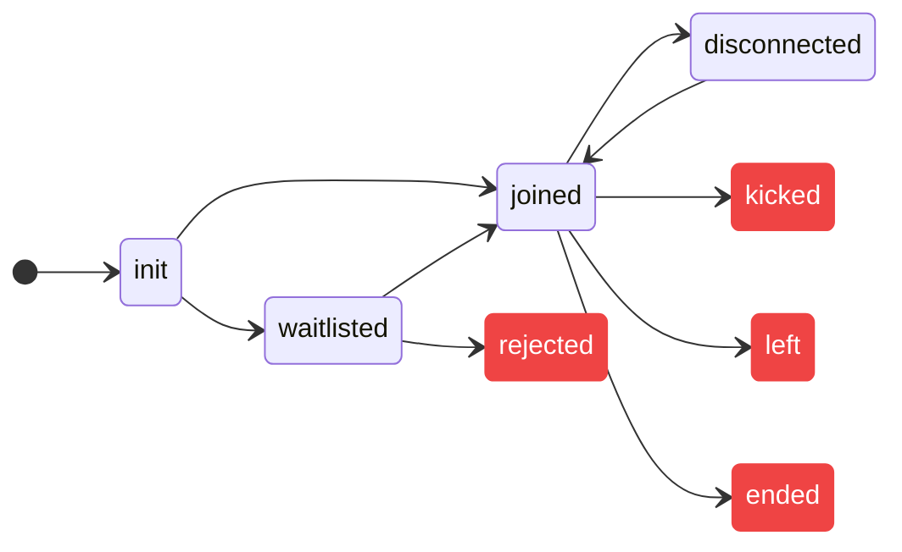

# Introduction

Accessible via `self` key within the `meeting` object, the local user object consists of all the information related to the current participant and methods to configure media and other states.

## Properties

Here is a list of properties that local user provides:

**Metadata**

- `userId`: User ID of the local user.
- `customParticipantId`: Identifier provided by the developer while adding the
  participant.
- `organizationId`: The ID of the organization the meeting is created from.
- `name`: Contains Name of the local user.
- `picture`: Display picture URL for the local user.
- `permissions`: The permissions related to various capabilities for the local user defined by the preset

**Media**:

- `mediaPermissions`: The current audio and video permissions given by the local
  user.
- `audioTrack`: The audio track for the local user.
- `rawAudioTrack`: The audio track for the local user without any middleware applied on it.
- `videoTrack`: The video track for the local user.
- `rawVideoTrack`: The video track for the local user without any middleware applied on it.
- `screenShareTracks`: The screen share video and audio tracks for the local
  user.
- `audioEnabled`: A boolean value indicating if the audio is currently enabled.
- `videoEnabled`: A boolean value indicating if the video is currently enabled.
- `screenShareEnabled`: A boolean value indicating if the screen share is
  currently enabled.

**States**:

- `waitlistStatus`: Indicates if the local user has been waitlisted or not. It
  can take the following values:

  ```ts
  'accepted' | 'waiting' | 'rejected' | 'none';
  ```

- `isPinned`: A boolean value indicating if the local user is pinned or not.
- `roomJoined`: A boolean value indicating if the local user is in the meeting
- `roomState`: Indicates the state of the user in the meeting. It
  can take the following values:

  ```ts
  'init' |
    'joined' |
    'waitlisted' |
    'rejected' |
    'kicked' |
    'left' |
    'ended' |
    'disconnected';
  ```



```ts
// subscribe to roomState
const roomState = useDyteSelector((m) => m.self.roomState)

return (
  <>
    {roomState === "disconnected" && <div>disconnected</div>}
    </>
)
```

## Change the name of the local user

Change the user's name by calling `setName` method. The changed name will
reflect across all participants ONLY if the change happens before joining the
meeting.

```ts
await meeting.self.setName('New Name');
```

## Media

### Mute/Unmute microphone

```ts
// Mute Audio
await meeting.self.disableAudio();

// Unmute Audio
await meeting.self.enableAudio();

// Get current status
meeting.self.audioEnabled;
```

### Enable/Disable camera

```ts
// Disable Video
await meeting.self.disableVideo();

// Enable Video
await meeting.self.enableVideo();

// Get current status
meeting.self.videoEnabled;
```

### Enable / Disable Screen share

```ts
// Enable Screenshare
await meeting.self.enableScreenShare();

// Disable Screenshare
await meeting.self.disableScreenShare();

// Get current status
meeting.self.screenShareEnabled;
```

<head>
  <title>React Web Core Introduction</title>
</head>
