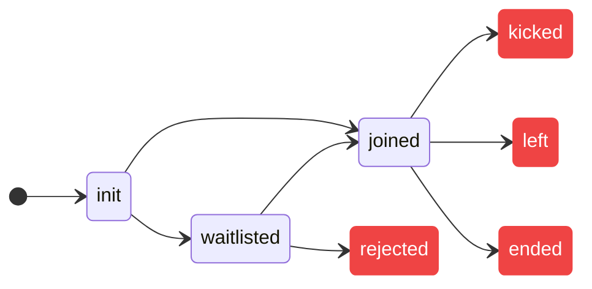
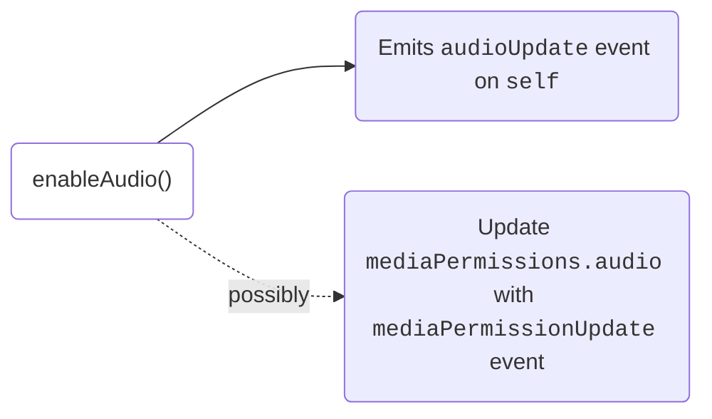

# Introduction

Accessible via `self` key within the `meeting` object, the local user object consists of all the information related to the current participant and methods to configure media and other states.

## Properties

Here is a list of properties that local user provides:

**Metadata**

- `userId`: User ID of the local user.
- `customParticipantId`: Identifier provided by the developer while adding the
  participant.
- `organizationId`: The ID of the organization the meeting is created from.
- `name`: Contains Name of the local user.
- `picture`: Display picture URL for the local user.
- `permissions`: The permissions related to various capabilities for the local user defined by the preset

**Media**:

- `mediaPermissions`: The current audio and video permissions given by the local
  user.
- `audioTrack`: The audio track for the local user.
- `videoTrack`: The video track for the local user.
- `screenShareTracks`: The screen share video and audio tracks for the local
  user.
- `audioEnabled`: A boolean value indicating if the audio is currently enabled.
- `videoEnabled`: A boolean value indicating if the video is currently enabled.
- `screenShareEnabled`: A boolean value indicating if the screen share is
  currently enabled.

**States**:

- `isPinned`: A <span className="tag-orange">boolean</span> value indicating if the local user is pinned or not.
- `roomJoined`: A <span className="tag-orange">boolean</span> value indicating if the local user is in the meeting
- `roomState`: Indicates the state of the user in the meeting. It
  can take the following values:

  ```ts
  'init' | 'joined' | 'waitlisted' | 'rejected' | 'kicked' | 'left' | 'ended';
  ```



<br />

## Change the name of the local user

Change the user's name by calling `setName` method. The changed name will
reflect across all participants ONLY if the change happens before joining the
meeting.

```ts
await meeting.self.setName('New Name');
```

## Media

### Mute/Unmute microphone

```ts
// Mute Audio
await meeting.self.disableAudio();

// Unmute Audio
await meeting.self.enableAudio();

// Get current status
meeting.self.audioEnabled;
```



### Enable/Disable camera

```ts
// Disable Video
await meeting.self.disableVideo();

// Enable Video
await meeting.self.enableVideo();

// Get current status
meeting.self.videoEnabled;
```


### Enable / Disable Screenshare

<Tabs
  groupId="mobile-pm"
  defaultValue="android"
  values={[
    { label: "Android", value: "android" },
    { label: "iOS", value: "ios" },
  ]}
>
  <TabItem value="android">
    ```ts
    // Enable Screenshare
    await meeting.self.enableScreenShare();

    // Disable Screenshare
    await meeting.self.disableScreenShare();

    // Get current status
    meeting.self.screenShareEnabled;
    ```

  </TabItem>
  <TabItem value="ios">
    - In <code>Xcode</code>, Go to Targets -> Add a target -> Choose <code>Broadcast Upload Extension</code> (Choose Swift as Language)  
    - Go to <code>Targets Signing & Capabilities</code>, and enable <code>App Groups</code> for both App target and Broadcast Upload Extension target
    - In the app's target, add the following in <code>Info.plist</code>:
      ```
        <key>RTCAppGroupIdentifier</key>
        <string>YOUR_APP_GROUP</string>
      ```
    - Add these changes to your iOS folder's Podfile:
      ```ruby
      target 'YOUR_APP_TARGET_NAME'
        ...

        post_install do |installer|
          ...
          # Add these for Dyte iOS Screenshare
          installer.pods_project.targets.each do |target|
            target.build_configurations.each do |config|
              config.build_settings['APPLICATION_EXTENSION_API_ONLY'] = 'No'
              config.build_settings['ENABLE_USER_SCRIPT_SANDBOXING'] = 'No'
            end
          end
          ...
        end

        ...
      end

      # Add this at the end of Podfile
      pod 'YOUR_BROADCAST_EXTENSION_TARGET_NAME'
          config = use_native_modules!
          use_react_native!(:path => config["reactNativePath"], :hermes_enabled => false)
          # Support ReactNativeCore Pod in the Broadcast Upload Extension
          pod 'ReactNativeCore', :path => '../node_modules/@dytesdk/react-native-core'
      end
      ```
    - Replace the <code>SampleHandler</code> in Broadcast Upload Extension with the following:
      ```swift
        import ReactNativeCore

        class SampleHandler: DyteScreenshareHandler {
          override init() {
            super.init(appGroupIdentifier: "YOUR_APP_GROUP", bundleIdentifier: "BUNDLE_IDENTIFIER_FOR_BROADCAST_UPLOAD_EXTENSION")
          }
        }
      ```
      > <b>Note:</b>
      Replace <code>YOUR_APP_GROUP</code> with your App Group Name and <code>BUNDLE_IDENTIFIER_FOR_BROADCAST_UPLOAD_EXTENSION</code> with Bundle Identifier of Screnshare Extension.
    - Go to Broadcast Extension target -> <code>Build Settings</code>
      - <code>Build Options</code> -> Set <code>User Script Sandboxing</code> to <code>No</code>
      - <code>Signing</code> -> <code>Enable App Sandbox</code> to <code>No</code>
    - Now enable the screenshare pop up handle and then enable Dyte's screenshare API:
      ```tsx
      // Import this component
      import { NativeModules, findNodeHandle } from 'react-native';
      import { ScreenCapturePickerView } from '@dyteinternals/react-native-webrtc';

      function MyComponent() {

        const screenCapturePickerViewRef = useRef(null);

        // Function to show ScreenCapture Picker
        const showScreenRecordPicker = async () => {
          const handle = findNodeHandle(screenCapturePickerViewRef.current);
          NativeModules.ScreenCapturePickerViewManager.show(handle);
        };

        // To enable screenshare
        await showScreenRecordPicker();
        await meeting.self.enableScreenShare();

        // To disable screenshare
        await meeting.self.disableScreenShare();

        return (
          ...
          // Add this in components
          <ScreenCapturePickerView ref={screenCapturePickerViewRef} />
          ...
        );

      }
      ```

  </TabItem>
</Tabs>
<head>
  <title>React Native Core Introduction</title>
</head>
