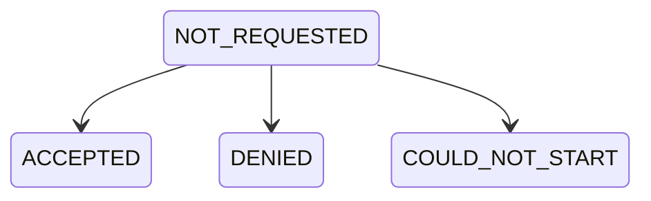

# Handling Permissions

## Properties

`self.mediaPermissions`: The current audio and video **app permissions** given by the local
user.

Permissions start with `NOT_REQUESTED` and can go into 4 different states

 

- `ACCEPTED` - The user accepted app permission prompts
- `DENIED` - The user denied app permission prompts
- `COULD_NOT_START` - Unable to start the selected device, you can retry with a different device

 
