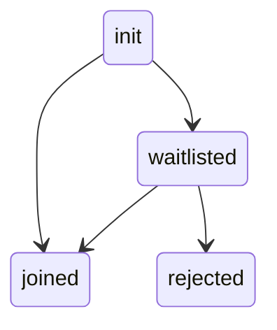

# Waiting Room

After you call `.join()` on meeting, you either get a `roomJoined` event if you are allowed to join or a `waitlisted` event.

Use the `self.roomState` to track the user's state in the meeting.



<br />

This diagram only represents the waiting room related states, the `roomState` property also transitions through other states

Each of these state changes generate their own events.

- **joined**

```ts
const roomState = useDyteSelector((m) => m.self.roomState);
const joined = roomState === 'joined';
```

Alternatively

```ts
meeting.self.on('roomJoined', () => {
  // local user is in the meeting
});
```

- **waitlisted**

```ts
const roomState = useDyteSelector((m) => m.self.roomState);
const isWaitlisted = roomState === 'waitlisted';
```

```ts
meeting.self.on('waitlisted', () => {
  // local user is waitlisted
});
```

- **rejected**

```ts
meeting.self.on('roomLeft', ({ state }) => {
  // state = rejected when host rejects the entry
});
```

Host can use [these methods to accept/reject participants](/rn-core/participants#waiting-room-methods)
