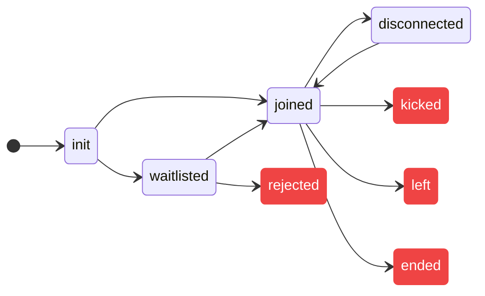
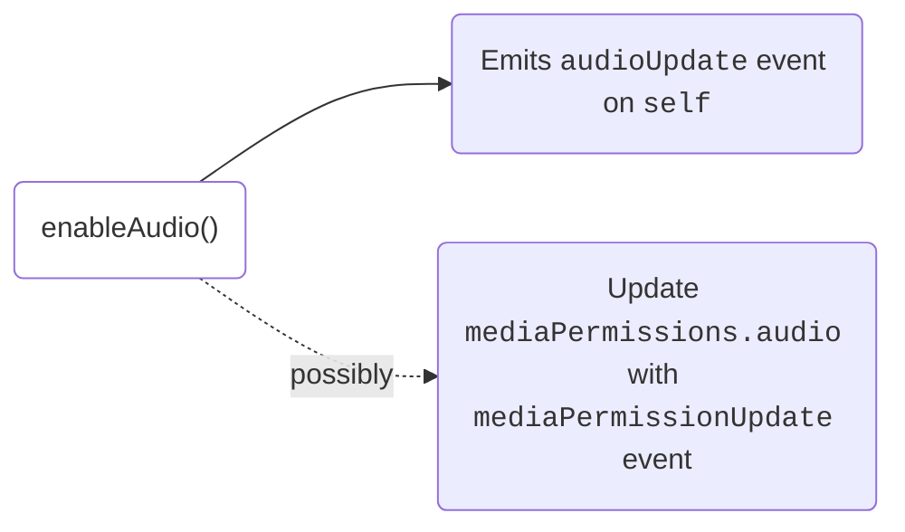

# Introduction

Accessible via `self` key within the `meeting` object, the local user object consists of all the information related to the current participant and methods to configure media and other states.

## Properties

Here is a list of properties that local user provides:

**Metadata**

- `userId`: User ID of the local user.
- `customParticipantId`: Identifier provided by the developer while adding the
  participant.
- `organizationId`: The ID of the organization the meeting is created from.
- `name`: Contains Name of the local user.
- `picture`: Display picture URL for the local user.
- `permissions`: The permissions related to various capabilities for the local user defined by the preset
- `config`: The configuration for how the meeting should appear for the local user

**Media**:

- `mediaPermissions`: The current audio and video permissions given by the local
  user.
- `audioTrack`: The audio track for the local user.
- `videoTrack`: The video track for the local user.
- `screenShareTracks`: The screen share video and audio tracks for the local
  user.
- `audioEnabled`: A boolean value indicating if the audio is currently enabled.
- `videoEnabled`: A boolean value indicating if the video is currently enabled.
- `screenShareEnabled`: A boolean value indicating if the screen share is
  currently enabled.

**States**:

- `isPinned`: A <span className="tag-orange">boolean</span> value indicating if the local user is pinned or not.
- `roomJoined`: A <span className="tag-orange">boolean</span> value indicating if the local user is in the meeting
- `roomState`: Indicates the state of the user in the meeting. It
  can take the following values:

  ```ts
  type RoomState =
    | 'init'
    | 'joined'
    | 'waitlisted'
    | 'rejected'
    | 'kicked'
    | 'left'
    | 'ended'
    | 'disconnected';
  ```




<Tabs groupId="framework" defaultValue="react">
  <TabItem value="js" label="Javascript">
If you would like to subscribe to roomState, you can do so by listening to the `roomLeft` and `roomJoined` events as seen [here](/web-core/local-user/events#room-joined).
```ts
const roomState = meeting.self.roomState;
```

  </TabItem>
  <TabItem value="react" label="React">
  
```ts
// subscribe to roomState
const roomState = useDyteSelector((m) => m.self.roomState)
return (
  <>
    {roomState === "disconnected" && <div>disconnected</div>}
  </>
)
```
  </TabItem>
</Tabs>

## Change the name of the local user

Change the user's name by calling `setName` method. The changed name will
reflect across all participants ONLY if the change happens before joining the
meeting.

```ts
await meeting.self.setName('New Name');
```

## Media

### Mute/Unmute microphone

```ts
// Mute Audio
await meeting.self.disableAudio();

// Unmute Audio
await meeting.self.enableAudio();

// Get current status
meeting.self.audioEnabled;
```



### Enable/Disable camera

```ts
// Disable Video
await meeting.self.disableVideo();

// Enable Video
await meeting.self.enableVideo();

// Get current status
meeting.self.videoEnabled;
```


### Enable / Disable Screen share

```ts
// Enable Screenshare
await meeting.self.enableScreenShare();

// Disable Screenshare
await meeting.self.disableScreenShare();

// Get current status
meeting.self.screenShareEnabled;
```

### Check all available media devices

```ts
// Returns all media devices accessible by the local participant.
await meeting.self.getAllDevices();
```

### Change the media device in use

Given a device parameter, switches the corresponding input to given device. You can choose which device needs to be changed to from using the above getAllDevices function

```ts
/**
 * Change the current media device that is being used by the local participant.
 * @param device The device that is to be used. A device of the same `kind` will be replaced.
 * the primary stream.
 */
await meeting.self.setDevice(device);
```

## Play Video Track

### Register Video Element

API to play a users video track on a provided `<video>` element.

```ts
// this is the video element where we want to play the users track
const videoElement = document.querySelector('video.participant');

meeting.self.registerVideoElement(videoElement);

// if you want to play a preview video track which is local
// and not sent to other users, you can pass
// the second argument `isPreview` as `true`.
meeting.self.registerVideoElement(videoElement, true);
```

### Deregister Video Element

There is also a way to deregister a video element.
This is typically done in the cleanup phase if you are using some framework like React.

```ts
meeting.self.deregisterVideoElement(videoElement);
```

<head>
  <title>Web Core Introduction</title>
</head>
