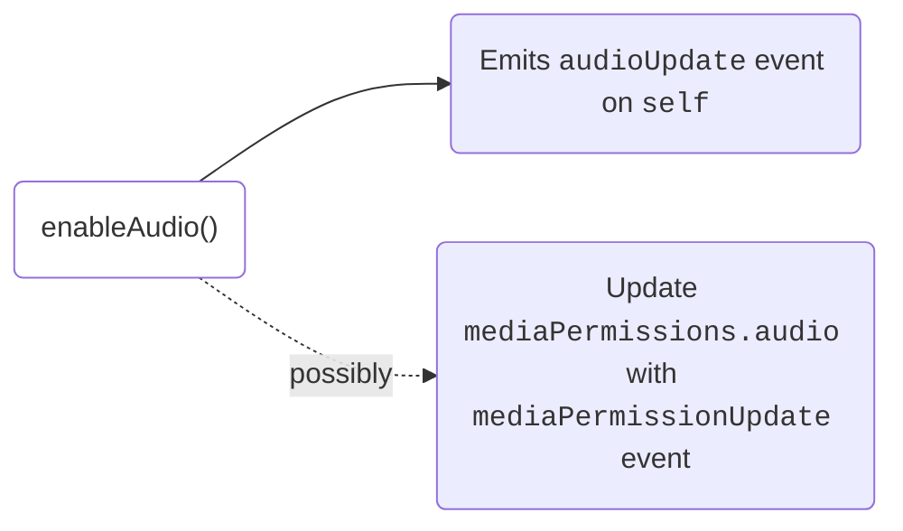

# Media Preview

This section focuses on pre-call functionality, providing developers with the tools needed to prepare the media environment before joining the meeting. If you are using our UI Kits, this will be handled by `dyte-setup-screen` or could be built with `dyte-participant-tile`, `dyte-settings` components.


## Properties

- `audioEnabled`: A <span className="tag-orange">boolean</span> value indicating if the audio currently enabled.
- `videoEnabled`: A <span className="tag-orange">boolean</span> value indicating if the video currently enabled.

- `audioTrack`: The audio track for the local user.
- `videoTrack`: The video track for the local user.

## Methods

### Toggling Media

The same methods used by post joining meeting are also used to control media-pre meeting.

**1. Mute/Unmute microphone**

```ts
// Mute Audio
await meeting.self.disableAudio();

// Unmute Audio
await meeting.self.enableAudio();
```



<br />

Anytime there is an update in audio state you will get a `audioUpdate` event

```ts

meeting.self.on('audioUpdate', ({ audioEnabled, audioTrack })=> {
  // if enabled show a visual(izer) preview of the audio to the user
});

```

**2. Enable/Disable camera**

```ts
// Disable Video
await meeting.self.disableVideo();

// Enable Video
await meeting.self.enableVideo();
```


<br />

```ts
meeting.self.on('videoUpdate', ({ videoEnabled, videoTrack })=> {
  // if videoEnabled play video here to a <video> element
});
```

### Changing Media Device

Media devices represents the hardware for the camera, microphone and speaker
devices. To get the list of media devices that are currently being used, you can
use the following methods:

```ts
// Fetch current media devices being used
const currentDevices = meeting.self.getCurrentDevices();
```

```js
// Get all media devices
const devices = meeting.self.getAllDevices();

// Get all audio devices
const audioDevices = meeting.self.getAudioDevices();

// Get all video devices
const videoDevices = meeting.self.getVideoDevices();

// Get all speakers
const speakerDevices = meeting.self.getSpeakerDevices();
```

These methods should be called when you want the user to be shown these preferences. When the user selects a device, use the below method to select the device.

**Set device**

```js
meeting.self.setDevice(device);
// eg. device = videoDevices[0];
```
