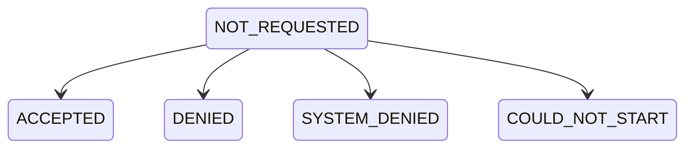
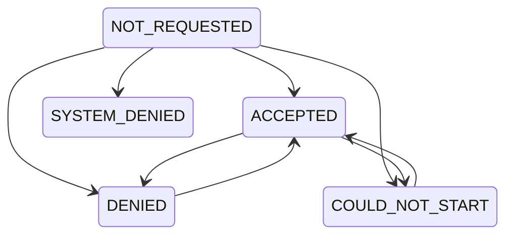

# Handling Browser Permissions

## Properties

`self.mediaPermissions`: The current audio and video **browser permissions** given by the local
user.

Permissions start with `NOT_REQUESTED` and can go into 4 different states



<br />

- `ACCEPTED` - The user accepted browser permission prompts
- `DENIED` - The user denied browser permission prompts
- `SYSTEM_DENIED` - The user's browser does not have the required permission, in this case this usually means the browser application lacks the necessary permission on the OS level
- `COULD_NOT_START` - Unable to start the selected device, you can retry with a different device

<br />

:::warning

One other thing to note down here is user might revoke permission later, or might unplug devices etc so these states can change at runtime

:::

<br />

Use the `mediaPermissionUpdate` event on `self` to listen for these changes

<Tabs groupId="framework" defaultValue="react">
  <TabItem value="js" label="Javascript">
```js
meeting.self?.addListener('mediaPermissionUpdate', ({ kind, message }) => {
  console.log(`Permission update for ${kind} is ${message}`);
});
```
  </TabItem>
  <TabItem value="react" label="React">
```js
useEffect(() => {
  const onMediaPermissionUpdate = ({ kind, message }) => {
    console.log(`Permission update for ${kind} is ${message}`);
  };
  meeting.self?.on('mediaPermissionUpdate', onMediaPermissionUpdate);
  return () => {
    meeting.self?.off('mediaPermissionUpdate', onMediaPermissionUpdate);
  };
}, [meeting]);
```
  </TabItem>
</Tabs>


